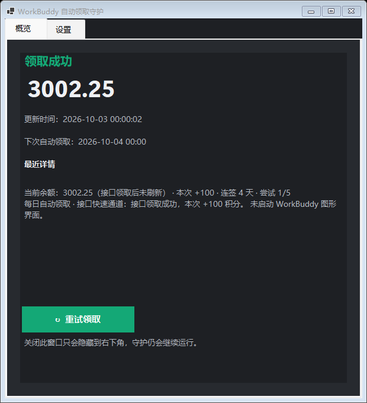
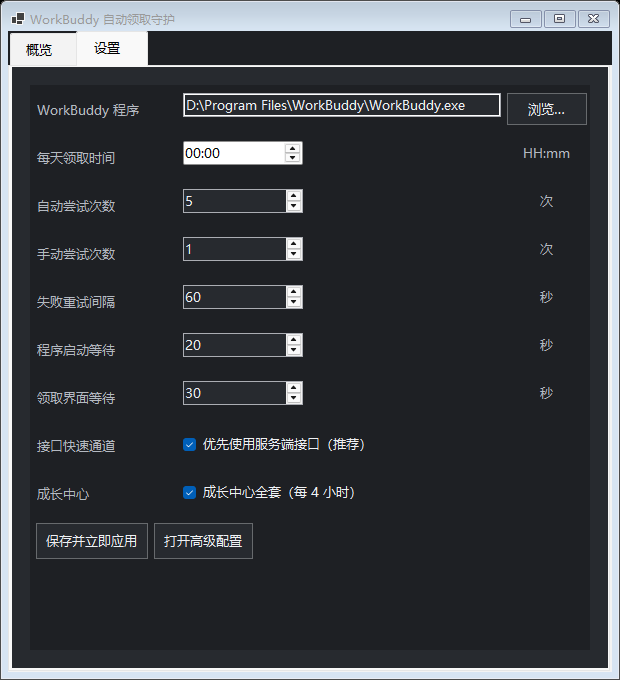

# WorkBuddy 自动领取

在 Windows 后台按计划领取 WorkBuddy 积分并运行成长中心的本地工具。默认先复用本机已登录的 WorkBuddy 会话，通过服务端接口快速签到、领取旅行礼物、派 Buddy、处理任务、补登、兑换连登奖励及开启盲盒；签到接口不可用时仍保留原有个人中心 OCR 流程。不会保存账号密码或令牌，也不会上传截图或 OCR 文字。

<p align="center">
  
</p>

## 界面预览

| 概览 | 设置 |
| --- | --- |
|  |  |

概览页展示本机最近一次真实执行记录；截图中的 `尝试 5/5` 是升级到 v1.1.5 前的历史结果，不代表新版默认会执行五次。

## 它会做什么

- 默认每天 `00:00` 尝试领取一次；时间可在 `config.json` 的 `ClaimTime` 中修改。
- 接口快速通道不依赖可交互桌面；只有回退到 OCR 时，锁屏、睡眠或桌面暂不可操作才每 `60` 秒等待一次，且不计入领取次数。
- 每日签到成功后不再反复领取；启用成长中心时每 `4` 小时仅运行一次幂等接口轮询，以便及时领取旅行礼物并再次派出 Buddy。
- 接口成功时不会启动 WorkBuddy 图形界面。只有 OCR 保底需要窗口：未运行时后台启动并在结束后关闭；原本前台则保持前台；原本最小化则完成后恢复最小化。
- 成功、今日已领取、失败都会发送 Windows 通知中心通知，并保留三天。
- 守护进程常驻在右下角通知区域：左键图标打开面板，右键可以打开面板、重试领取或退出守护。
- 右键菜单中的“开机启动”带勾选状态；取消勾选只关闭下次登录自启，当前守护不会退出。

## 守护面板

面板会自动适配 Windows 的浅色/深色模式，并分为“概览”和“设置”：

- “概览”显示最近领取状态、当前余额、成长中心最近结果、更新时间和下一次自动领取时间。
- “重试领取”按照“手动尝试次数”执行；运行期间按钮会锁定，避免重复提交。
- “设置”可开关接口快速通道和成长中心，并修改 WorkBuddy 路径、领取时间、自动/手动尝试次数、失败间隔以及两个界面等待时间。
- 点击“保存并立即应用”会唤醒守护并重新计算计划，不需要重启程序。
- 关闭面板只会隐藏到右下角；要停止常驻守护，请右键托盘图标并选择“退出守护”。
- “打开高级配置”可编辑 OCR 与界面适配参数，面板保存常用设置时会保留这些高级参数。

## 领取与核验逻辑

### 接口快速通道（默认）

1. 从 WorkBuddy 本机登录会话读取接口地址、用户标识和访问令牌；兼容明文令牌及 `sym-v1` 加密令牌。令牌只保留在本次进程内存中，不写入配置、日志、状态或通知。
2. 只允许向 `ApiAllowedHosts` 白名单中的 HTTPS 域名发送令牌，默认仅 `copilot.tencent.com`。发现未知域名时立即提示，绝不发送令牌，并转入 OCR；可在概览页手动允许或拒绝该域名。
3. 每次先调用只读状态接口。已领取则直接结束；未领取才调用每日领取接口；`credit` 字段是接口领取成功的必要依据。
4. 领取请求超时或响应丢失后，不立即启动 OCR，而是在下一次先查状态，避免重复领取。HTTP 429 最多按服务端要求等待 60 秒；HTTP 401 全程只重新读取一次本地会话。
5. 自动任务最多 5 次，间隔依次为 5、15、30、60 秒。`active=false` 时只执行一次完整 OCR；接口状态查询在发送领取前就失败时，可在当前尝试转入 OCR。
6. 接口成功会显示本次增加积分及连签天数。由于没有打开个人中心，余额沿用最近一次 OCR 数值并明确标注“接口领取后未刷新”。

### 成长中心（默认开启）

每日签到确认完成后立即运行一次，之后每四小时轮询。执行顺序和业务判断沿用 `88lin/workbuddy-auto-signin`：

1. 领取已到达的旅行礼物；只有领取成功后才再次派 Buddy，且服务端已确认今日名额用完时不再请求出发。
2. 批量接受未领取的新任务，再领取状态为 `completed` 的任务奖励；服务端实发数值优先于任务列表展示值。
3. 根据服务端日期和活跃日历识别当月明确断登日期；每轮最多消耗一张补登卡，最近断点优先，异常或缺失日历绝不猜测。
4. 依次处理 7、14、28 天连登奖励；优先使用服务端给出的 `7d/14d/28d` 档位标识，只在明确返回未知档位时回退旧的天数写法。
5. 每轮最多使用一次抽奖机会；实物奖会提醒你进入成长中心填写收件信息。
6. 能量足够时按服务端 `affordable` 和 `max_open_count` 开启 Buddy 盲盒。
7. 查询操作只对网络错误和服务端 `5xx` 按上游节奏退避；领奖、补登、兑换、抽奖等写操作绝不因超时自动重发。单轮默认预算 `180` 秒，避免后台任务被强制结束而没有日志。

空轮询不会弹通知；领到奖励或出现需要处理的问题时，结果会进入通知、日志和守护面板。关闭“成长中心”只停止这些成长任务，不影响每日签到及 OCR 保底。

### OCR 保底通道

每次尝试严格按以下顺序执行：

1. 最多点击左下角个人中心三次；每次点击后，以“积分余额”、同行明确数字和至少一项个人菜单文字共同确认面板已经打开。
2. 识别“积分余额”同行的刷新图标并点击；只有同一个明确数字连续两帧一致，才记录为领取前余额。午夜若显示“获取中”，就在当前第 1 次内自适应等待最多 90 秒，数字一出现立即继续，不把服务器加载过程误计为第 2～5 次。
3. 每次成功读取并确认积分余额后，立即扫描以 WorkBuddy 客户区左下角为锚点的固定 `366×647` 区域；窗口较小时只取实际可用范围。该区域同时覆盖个人中心面板、左下个人中心按钮和当前版本的领取卡片，并依次检查“立即领取”、连续两帧的“今日已领/已领取”、以及“签到领积分/去签到/签到”。
4. 个人中心首次扫描只执行一次固定区域直读；如果三类文字都没有、也没有点击过签到入口，则直接精确定位并点击同一面板中的“Buddy加油站”，等待页面加载后继续按相同优先级扫描。原图分块、灰度和反色增强仍保留在 Buddy 页面与传统后备路径中。此快速路径避免在个人中心无按钮时耗尽全部增强 OCR。
5. 只有“Buddy加油站”快速路径不可用或页面没有出现可确认动作时，才执行兼容后备：关闭个人中心并再次扫描左下固定区域，随后重新打开个人中心、确认余额、再次扫描，再进入 Buddy 加油站。
6. 点击签到入口后等待“立即领取”；没有出现最终按钮时继续后续兜底路径，签到入口本身不算领取成功。
7. “立即领取”使用左下固定区域直读；直读漏字时先动态检测黑色按钮候选并对其进行 5 倍放大、反色 OCR，再使用保持完整宽度的纵向重叠分块、灰度和反色 OCR 兜底。候选矩形本身绝不会触发点击：清除空格与标点后必须仍然恰好是四个字，并且至少两个字与“立即领取”在相同位置一致才允许点击；少于或多于四字、字符顺序错乱或只有一个同位置字符均不会触发最终领取。
8. 点击“立即领取”后重新打开个人中心、点击刷新并连续两帧确认余额：余额增加才判定为领取成功；余额不变且连续看到已领取状态才判定为“今日已领取”；其余情况均失败。

按钮与余额均由 OCR 在左下固定区域内动态识别，点击坐标来自 OCR 并映射回完整窗口，不依赖固定领取按钮坐标、Buddy 加油站期数或界面颜色。因此 WorkBuddy 的浅色/深色模式和该区域内的普通布局变化都有适配空间。

## 通知内容

通知正文将状态与余额放在同一行，避免 Windows 通知中心折叠后遗漏余额：

- `领取成功 · 积分余额：领取前 → 领取后`
- `今日已领取 · 当前余额：余额`
- `领取失败 · 最后读取余额：余额`

如果 Windows 禁止应用通知，工具会写入日志并退回为临时托盘气泡；请在 Windows 设置中允许 WorkBuddy Auto Claim 通知。

## 安装与启动

### 前提

- Windows 10 版本 19041 或更高。
- 已安装并登录 WorkBuddy。
- 已安装 .NET 8 Desktop Runtime（如果双击程序没有任何反应，先安装它）。

### 首次安装

1. 打开 PowerShell，进入项目目录并构建：

   ```powershell
   powershell.exe -NoProfile -ExecutionPolicy Bypass -File .\build.ps1
   ```

2. 双击 `install.cmd`，或运行：

   ```powershell
   .\install.cmd
   ```

这会为当前用户创建开机自启任务，并启动后台守护。首次运行会在 `release\` 内从 `config.example.json` 创建 `config.json`。

要删除开机自启任务，双击 `uninstall.cmd`。它不会强制结束已经运行的守护进程；当前进程会在退出登录或下次重启后停止。

## 配置

推荐从右下角托盘图标打开“设置”修改；保存后立即生效。也可以直接编辑 `release\config.json`，守护会在下一次唤醒时重新读取。

常用项如下：

| 配置项 | 默认值 | 说明 |
| --- | --- | --- |
| `WorkBuddyPath` | `D:\Program Files\WorkBuddy\WorkBuddy.exe` | WorkBuddy 程序路径 |
| `ClaimTime` | `00:00` | 每日领取时间，格式 `HH:mm` |
| `RetryIntervalSeconds` | `60` | 守护发生一般异常后的再次检查间隔；锁屏等待固定为 60 秒 |
| `MaxAttempts` | `5` | 每日自动领取的最多尝试次数，硬上限为 5 |
| `ManualMaxAttempts` | `1` | 面板或 `--manual-test` 手动领取的最多尝试次数 |
| `LaunchWaitSeconds` | `20` | 启动 WorkBuddy 后的等待秒数 |
| `CardReadyTimeoutSeconds` | `30` | 普通界面等待秒数；明确处于余额加载态时自动扩展至至少 90 秒，数字出现后立即结束等待 |
| `UseApiFastPath` | `true` | 优先使用服务端接口；关闭后始终使用 OCR |
| `ApiTimeoutSeconds` | `15` | 单次接口请求超时，允许 5～60 秒 |
| `ApiRefreshOnUnauthorized` | `true` | HTTP 401 后重新读取一次本机登录会话 |
| `EnableGrowthCenter` | `true` | 启用旅行、任务、补登、连登奖励、抽奖和 Buddy 盲盒 |
| `GrowthPollHours` | `4` | 每次成长中心轮询的间隔小时数，允许 1～24 |
| `GrowthRunBudgetSeconds` | `180` | 单轮成长中心总时间预算，允许 30～240 秒 |
| `GrowthRequestTimeoutSeconds` | `30` | 成长中心单次查询超时；配合总预算动态收缩 |
| `ApiAllowedHosts` | `copilot.tencent.com` | 可接收登录令牌的精确域名白名单 |
| `ApiRejectedHosts` | 空 | 在概览页拒绝过的域名；不会再次询问或发送令牌 |
| `ApiAuthFilePath` | 空 | 可选的 WorkBuddy 会话文件路径；留空时自动发现 |
| `ImmediateClaimKeywords` | `立即领取` | 最终领取按钮的识别文字 |
| `CheckInKeywords` | `签到领积分`、`去签到`、`签到` | 进入领取流程的入口文字 |

其余 `Balance*`、`VisualBalance*`、`Profile*` 配置用于 OCR 兼容和截图校准。正常使用无需修改；只有 WorkBuddy 大版本改版、日志和诊断截图显示定位失败时才调整。

## 测试与常用命令

所有命令均从 `release\` 目录运行：

```powershell
cd .\release

# 运行内置回归检查；不会领取
.\WorkBuddyAutoClaim.exe --self-test

# 运行成长中心完整离线 HTTP 夹具；不会读取本机会话或访问真实接口
.\WorkBuddyAutoClaim.exe --growth-test

# 使用真实本机会话只查询签到状态；明确不会调用领取接口
.\WorkBuddyAutoClaim.exe --api-status-test

# 验证托盘图标和 GUI 能创建；不会启动或控制 WorkBuddy
.\WorkBuddyAutoClaim.exe --ui-smoke-test

# 读取当前余额并发送一条真实 Windows 通知；不会点击签到或领取
.\WorkBuddyAutoClaim.exe --test-notification

# 打开个人中心、验证“积分余额”并保存截图；不会领取
.\WorkBuddyAutoClaim.exe --test-personal-center

# 验证快速路径耗时：读取余额并进入 Buddy 加油站，只识别状态，不点击领取或签到
.\WorkBuddyAutoClaim.exe --test-fast-route

# 对已有截图检查余额和领取文字；不会控制 WorkBuddy
.\WorkBuddyAutoClaim.exe --verify-claim-ocr "C:\path\to\screenshot.png"

# 单独验证左下固定区域的“立即领取”四字 OCR；不会控制 WorkBuddy
.\WorkBuddyAutoClaim.exe --verify-immediate-ocr "C:\path\to\screenshot.png"

# 验证个人中心组合锚点、余额和刷新图标；不会控制 WorkBuddy
.\WorkBuddyAutoClaim.exe --verify-personal-center-ocr "C:\path\to\screenshot.png" "2258.6"
```

以下命令会执行一次真实领取流程，适合在需要人工验证时使用：

```powershell
.\WorkBuddyAutoClaim.exe --manual-test
```

手动测试按 `ManualMaxAttempts` 执行（默认一次），不会写入当天的自动领取成功状态；失败后会停止并等待处理，后台守护随后恢复。

## 日志与排错

工具的运行数据都在：

```text
%LOCALAPPDATA%\WorkBuddyAutoClaim\
```

重点文件：

- `workbuddy-auto-claim.log`：运行、OCR、通知与失败原因。
- `state.json`：当天自动领取的成功或终止失败状态，以及最近成长中心轮询时间。
- `run-status.json`：守护面板显示的最近领取状态、余额、成长中心结果和尝试次数。
- `workbuddy-*.png`：领取前后、个人中心识别失败等诊断截图。
- `workbuddy-personal-center-ocr-failure.txt`：识别失败时保存的 OCR 原文。

常见检查顺序：

1. 运行 `--test-notification`，确认通知中心能看到“当前余额”。
2. 运行 `--test-personal-center`，确认个人中心截图中可见“积分余额”。
3. 若每日未运行，检查 `workbuddy-auto-claim.log` 中是否有“桌面已锁定”“未发现积分余额”或“通知中心 Toast 被 Windows 阻止”。
4. 发生界面改版时，保留对应诊断截图和日志，再调整 OCR 配置或更新工具。

## 稳定性与恢复

- Windows OCR 的执行预算为 8 秒；超时后立即终止子进程，并最多再等待 2 秒确认进程退出。本次会归类为“OCR 超时”并安全失败，不会盲点。
- “立即领取”和“签到/签到领积分”均只在左下 `366×647` 固定区域识别；直读漏字时，“立即领取”会优先对动态检测到的黑色按钮候选进行 5 倍放大和反色 OCR，再按完整宽度纵向重叠分块尝试原图、灰度和反色 OCR；所有识别坐标都会映射回完整窗口后再点击。
- 积分数字会在 OCR 定位到的余额同行中避开刷新图标后单独放大，并在文字右侧和底部保留随字号变化的上下文边距，防止过紧裁剪改变首位数字。刷新图标即使被 OCR 拆成独立行、余额仍显示“获取中”，也会由“积分余额”同行和个人中心菜单共同约束后点击；加载等待保留在当前尝试内。Buddy 入口兼容本机 Windows OCR 已观察到的 `8uddy加油站` 首字母误读。
- 已直接读到“今日已领/已领取”时，会先用普通 OCR 连续两帧确认；只有未发现立即领取和已领状态时才启动分块、灰度、反色增强 OCR，减少正常成功路径耗时。
- 点击“签到”或“立即领取”后，工具必须观察到界面真实变化；明确数字余额增加才会报告领取成功，余额不变时还必须在变化后的界面中连续确认“今日已领”或“已领取”，余额下降则安全失败。
- 在领取前、打开个人中心、签到入口后和领取结果核验期间，只要检测到“登录失效”“请登录”或“重新登录”，就通知你手动登录并停止当天后续尝试。
- `state.json` 使用原子写入和 `.bak` 备份。两份状态都损坏时，当天安全停止并通知，不会重复领取。
- 安装的 Windows 任务在登录时启动守护进程；守护异常退出时，任务计划会每分钟最多重启 3 次。
- 安装、手动测试或安全测试结束时，工具优先请求任务计划恢复守护；只有新守护完成配置加载并主动发出就绪信号后才记录恢复成功，直接启动回退也执行同样确认。
- `build.ps1` 同时生成 `artifacts\WorkBuddyAutoClaim-v1.3.0.zip`；包内不包含本机 `config.json`、PDB、状态或诊断数据。
- `%LOCALAPPDATA%\WorkBuddyAutoClaim\workbuddy-auto-claim.log` 只保留最近 30 天；`diagnostics\` 仅保留最新 20 份失败诊断。诊断包包含截图、OCR 原文、WorkBuddy 版本、窗口尺寸和 DPI；成功领取不会保留领取截图。

失败通知除余额外，还会包含失败阶段、已执行尝试次数，以及 WorkBuddy 是保留原前台、保留后台最小化，还是由工具启动后关闭。

## 项目关系

本项目是独立仓库实现，不是 `GitOfUser/workbuddy-checkin` 的 Fork，也不共享提交历史。早期仅参考了其流程思路；本工具的后台行为、OCR 校验、通知和维护均独立实现。

接口会话兼容、签到端点和成长中心业务策略参考并改写自 MIT 许可项目 [88lin/workbuddy-auto-signin](https://github.com/88lin/workbuddy-auto-signin)，固定参考提交为 `cb2bf1f02db8900922dc0f06090cdb7334d45ff5`。完整许可见 [THIRD_PARTY_NOTICES.md](THIRD_PARTY_NOTICES.md)。本项目不会自动下载或执行上游代码；上游变化只会提示人工审查并随本项目新版 EXE 发布。
